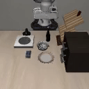
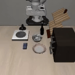

# ErrGAN: Error Recognition and Intention Guided GAN 

## Overview

**ErrGAN** is a novel approach designed to detect and fix errors in imitation learning tasks. By leveraging Generative Adversarial Networks (GANs), this framework not only identifies errors but also backtracks to pinpoint the root cause and correct it using an intention-guided mechanism.

The framework consists of two main components:

1. **V_GAN**: Discriminator that evaluates the value of the current trajectory using state sequences, image sequences, and language embeddings.
2. **Q_GAN**: Generator that predicts the optimal action for the current trajectory based on state sequences, image sequences, and language embeddings.

### Workflow

1. **Error Detection**: The discriminator (V_GAN) identifies errors in the trajectory.
2. **Backtracking**: The system backtracks 20 steps before the detected error to understand the error intention and its root cause.
3. **Intention-Guided Correction**: The generator (Q_GAN) proposes corrective actions to guide the trajectory back on track.

### Visual Examples

<table>
  <tr>
    <td style="text-align: center;">
        <h4>Intention Guided</h4>
        
    </td>
    <td style="text-align: center;">
        <h4>Error + Backtracking</h4>
        
    </td>
  </tr>
</table>
